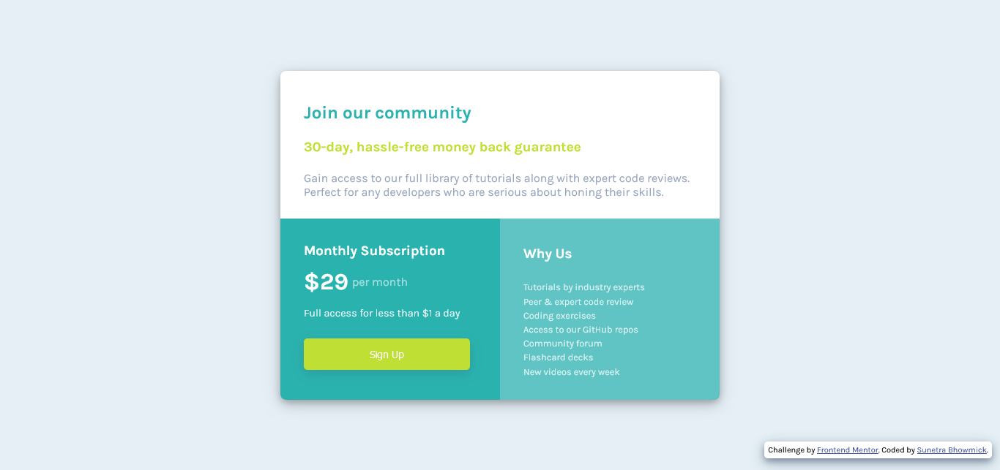

# Frontend Mentor - Single price grid component solution

This is a solution to the [Single price grid component challenge on Frontend Mentor](https://www.frontendmentor.io/challenges/single-price-grid-component-5ce41129d0ff452fec5abbbc). Frontend Mentor challenges help you improve your coding skills by building realistic projects. 

## Table of contents

- [Overview](#overview)
  - [The challenge](#the-challenge)
  - [Screenshot](#screenshot)
  - [Links](#links)
- [My process](#my-process)
  - [Built with](#built-with)
  - [What I learned](#what-i-learned)
  - [Continued development](#continued-development)
  - [Useful resources](#useful-resources)
- [Author](#author)

## Overview

### The challenge

Users should be able to:

- View the optimal layout for the component depending on their device's screen size
- See a hover state on desktop for the Sign Up call-to-action

### Screenshot



### Links

- Solution URL: [Add solution URL here](https://your-solution-url.com)
- Live Site URL: [Add live site URL here](https://your-live-site-url.com)

## My process

### Built with

- Semantic HTML5 markup
- Flexbox
- CSS media query
- Mobile-view design
- Responsive web design

### What I learned

I have used CSS flexbox to style the layout and used CSS media queries to build a mobile-friendly view depending on the screen size. I faced issues to enable scrolling while working in a small screen size - and finally fixed it with the `overflow-y` property. This project was as a great practice for CSS flexbox and especially media queries.

This is how I enabled vertical scrolling for smaller screen sizes :

```css
#card {
  /* Other properties set as per requirements - not included here */

  overflow-y: auto; /* For vertical scrolling */

  /* Also added some fixed margin for visual clarity */
  margin-bottom: 60px;
  margin-top: 60px;
}

```

### Continued development

I think I can focus on improving the design to be compatible to most of the major device sizes and specifications. Also, I am planning to design this with CSS grid.

### Useful resources

- [CSS Media Query](https://www.browserstack.com/guide/what-are-css-and-media-query-breakpoints) - This article helped me a lot to revisit the concepts of CSS media queries. I'd recommend it to anyone still learning this concept.
- [Free Code Camp](https://www.freecodecamp.org/) - This is one of the most amazing websites to learn web development for free. I strongly recommend their learning program to anyone willing to sharpen all relevant skills.

## Author

- GitHub - [@kaiser-sb](https://github.com/kaiser-sb)
- Frontend Mentor - [@kaiser-sb](https://www.frontendmentor.io/profile/kaiser-sb)
- LinkedIn - [Sunetra Bhowmick](https://www.linkedin.com/in/kaiser-sb/)

